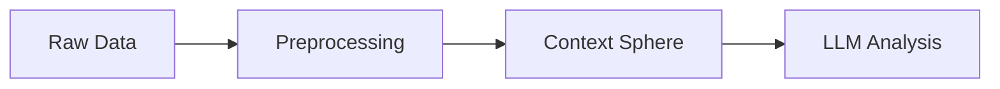
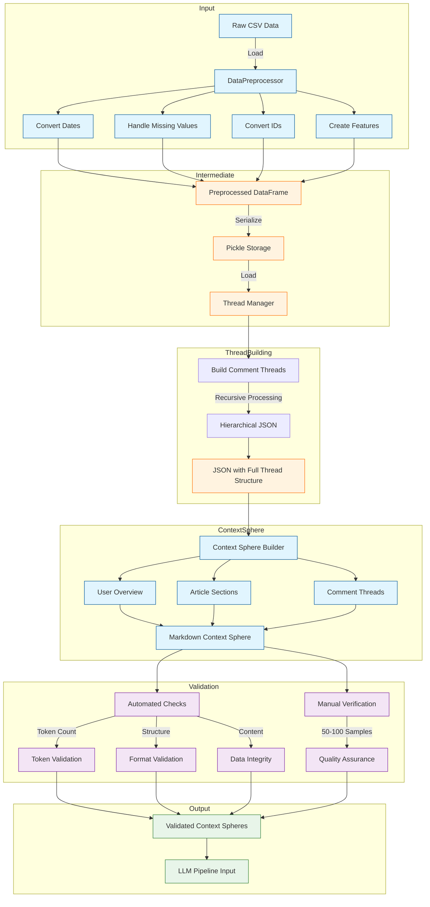

# Preprocessing Pipeline Documentation
## Executive Summary

Quick Links: 
[Technical Documentation](technical_documentation.md) | [Theoretical Alignment](theoretical_alignment.md) | [Implementation Analysis](implementation_analysis.md)

### Overview
This documentation describes a preprocessing pipeline designed to transform online newspaper comments into context-rich datasets suitable for emotion analysis using Large Language Models (LLMs), aligned with Lisa Feldman Barrett's theory of constructed emotions.

### Key Components
1. **Technical Documentation**
   - Data transformation workflow (CSV → JSON → Markdown)
   - Context Sphere structure
   - Implementation considerations

2. **Theoretical Alignment**
   - Integration with Barrett's theory
   - Technical evolution enabling implementation
   - Context preservation approach

3. **Implementation Analysis**
   - Design decisions and rationale
   - Data quality considerations
   - Validation approach

### Quick Start

### Detailed Pipeline Flow

### Key Features
- Context-rich data transformation
- Theory-aligned preprocessing
- Robust validation strategy

### Documentation Structure
- [Technical Documentation](technical_documentation.md)
- [Theoretical Alignment](theoretical_alignment.md)
- [Implementation Analysis](implementation_analysis.md)

### Important Considerations
- Token length: 5,000-15,000 tokens per context sphere
- UTF-8 encoding throughout
- Manual validation of 50-100 samples

### Future Work
- Scalability improvements
- Automated testing expansion
- Performance optimization
