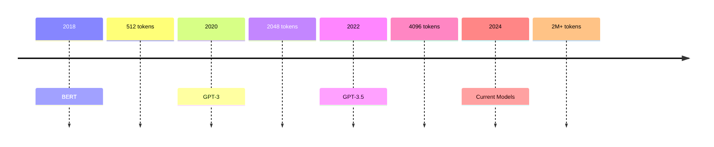

# Theoretical Alignment Documentation: Preprocessing Pipeline

[← Technical Documentation](technical_documentation.md) | [Implementation Analysis →](implementation_analysis.md)

## Table of Contents
- [Barrett's Theory Integration](#barretts-theory-integration)
  - [Core Theory Elements Support](#core-theory-elements-support)
  - [Theoretical Principles Implementation](#theoretical-principles-implementation)
- [Technical Evolution Enablers](#technical-evolution-enablers)
  - [LLM Context Window Evolution](#llm-context-window-evolution)
  - [Processing Capabilities](#processing-capabilities)
- [Context Preservation and Emotion Theory](#context-preservation-and-emotion-theory)
  - [Context Levels Integration](#context-levels-integration)
  - [Emotional Construction Elements](#emotional-construction-elements)
- [Research Alignment](#research-alignment)

---

## Barrett's Theory Integration

### Core Theory Elements Support

> **Purpose**: Demonstrate how preprocessing aligns with key aspects of Barrett's theory

#### Context Dependency
| Feature | Implementation | Rationale |
|---------|---------------|-----------|
| Conversation Threads | Full preservation | Maintains emotional context |
| Temporal Relationships | Chronological ordering | Shows emotion development |
| Social Interactions | Thread structure | Captures social influence |

#### Cultural and Social Factors
- **Article Themes**
  - Channel categorization
  - Topic preservation
  - Cultural context markers

- **Community Interactions**
  ```markdown
  Article: Political Discussion
  > User A: Initial perspective
  >> User B: Cultural reference
  >>> User A: Contextual response
  ```

#### Individual Experience
- User history tracking
- Interaction pattern preservation
- Temporal progression maintenance

> *Rationale*: Supports Barrett's view that emotions are context-dependent constructs

### Theoretical Principles Implementation

#### Emotion Construction Context
- **Situational Framework**
  - Article context
  - Discussion themes
  - Temporal markers

- **Development Tracking**
  - Thread structure
  - Response patterns
  - Context evolution

#### Social Reality Integration
- Community dynamics preservation
- Discussion theme maintenance
- Response pattern capture

## Technical Evolution Enablers

### LLM Context Window Evolution

#### Historical Progression


#### Impact on Implementation
- **Full Context Preservation**
  - Complete conversation threads
  - Historical user activity
  - Article context integration

- **Analysis Capabilities**
  - Comprehensive user history
  - Rich contextual processing
  - Pattern recognition

### Processing Capabilities

#### Evolution of Capabilities
- Token processing efficiency
- Complex context understanding
- Nuanced relationship processing

#### Implementation Benefits
| Capability | Benefit | Application |
|------------|---------|-------------|
| Context Processing | Rich analysis | Emotion construction |
| Temporal Analysis | Pattern recognition | User behavior |
| Social Understanding | Interaction analysis | Community dynamics |

## Context Preservation and Emotion Theory

### Context Levels Integration

#### Immediate Context
- **Comment Content**
  ```markdown
  > Original comment with emotional expression
  >> Immediate response showing interaction
  >>> Emotional development in thread
  ```

#### Historical Context
- User activity patterns
- Community engagement history
- Topic involvement tracking

#### Social Context
- Community interactions
- Discussion dynamics
- Response patterns

### Emotional Construction Elements

#### Implementation Support
1. **Situational Factors**
   - Article themes
   - Discussion context
   - Temporal aspects

2. **Personal Factors**
   - User history
   - Interaction patterns
   - Response styles

3. **Social Factors**
   - Community dynamics
   - Cultural references
   - Interaction patterns

## Research Alignment

### Problem Statement Support
- ✓ Enables context-rich analysis
- ✓ Supports theoretical integration
- ✓ Facilitates comprehensive study

### Research Question Alignment
- ✓ Structured context for LLM analysis
- ✓ Theory-informed processing
- ✓ Contextual richness support

### Methodological Support
- ✓ Systematic context analysis
- ✓ Theoretical framework application
- ✓ Comprehensive evaluation

---

[↑ Back to Top](#theoretical-alignment-documentation-preprocessing-pipeline)